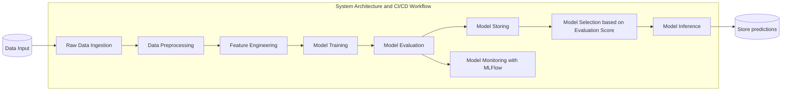

# BCCD (Bank Customer Churn Detection)

<a target="_blank" href="https://cookiecutter-data-science.drivendata.org/">
    
</a>


## Project Description
The BCCD is an Machine Learning predictive solution designed to help a fictional finance institution to prevent its customers from leaving their business. By analyzing the customers data, BCCD integrates Machine Learning techniques with automated data handling to provide information of which current customers have a high probability of leaving the institution, allowing the reponsible team to address said customers with intent to prevent their exit. With a modular structure, it is a robust approach to a common problem in this segment.

## Table of Contents
- [Project Architecture](#project-architecture)
  - [Training Module](#training-module)
  - [Inference Module](#inference-module)
  - [MLFlow Module](#mlflow-module)
- [Configuration](#installation)
  - [Prerequisites](#prerequisites)
  - [Managing Data](#managing-data)
  - [Environment Variables](#environment-variables)
  - [Docker (Optional)](#docker-optional)
  - [Modules Configuration](#modules-configuration)
- [Usage](#usage)
  - [Running the Pipelines](#running-the-pipelines)
- [Project Structure](#project-structure)
  - [System Architecture](#system-architecture)
  - [Directory Layout](#directory-layout)
- [Additional Resources](#additional-resources)


## Project Architecture

### Training Module

**Purpose**: Train a machine learning model that predicts which customers have higher chance of leaving.

**Functionality**: 
    - Conducts hyperparameter tuning to optimize model performance.
    - Stores trained model artifacts for use in predictions. 
**Output**: Models that reflects chance of churn based on customers' behavior.

### Inference Module
**Purpose**: Generate predictions for a batch of customers using the best performing model.

- **Functionality**:
  - Integrates with the processed data and model artifacts to produce predictions, storing the results.

**Output**: Churn predictions for each customer in the schema `RowNumber`, `predictedValue`.

### MLFlow Module
Purpose: Track and monitor model training and performance metrics for auditing and reproducibility.

- **Functionality**:
  - Logs model training runs, hyperparameters, and performance metrics.
  - Provides a centralized platform for tracking model versions and comparing performance over time.
  - Supports model versioning and artifact storage for reproducibility and auditing purposes.

- **Output**: Centralized tracking of model training and performance metrics for auditing and reproducibility.
- **Automation**: Automatically run through the training module, tracking the model's evolution and performance metrics.


## Configuration

### Prerequisites

- **Python 3.11**
- **Docker** (for Mlflow server, if desired)

### Managing Data

For this application to work, data should be stored correctly. Both training and inference data must be stored in the `data` folder, as follows:
- Training Data -> `data/training/raw/training_data.csv`
- Inference Data -> `data/inference/raw/inference_data.csv`

### Environment Variables
For the development of BCCD and its modules, we use a .env file to manage essential environment variables. This file ensures that all necessary configurations are available during the project's execution.

Using Visual Studio Code (VSCode), the .env file is automatically loaded in modes configured by launch.json. This allows developers to run or debug the code without manually loading environment variables.

If you are not using VSCode or prefer to manually load environment variables in the code, you can use the dotenv library to load the .env file since Python does not natively support this. **Remember that using this library requires code changes**. 

To configure the environment for the directory, create a copy of the .env.example file and rename it to .env in the root of the directory. The file has the following structure; **don't forget to replace it with appropriate values, as the ones below are illustrative and do not represent actual values**:

```bash
### PATH CONFIGURATION ###
ROOT_PATH='path/to/project/finance_churn_project'

### MLFLOW CONFIGURATION IF WANTED TO USE A MLFLOW SERVER ###
URL_MLFLOW='your-mlflow-url' #Default: http://localhost:5000/


```

In case you don't want to apply any code changes, you can make use of the following alternatives:

**Setting Environment Variables Directly in the Terminal - Linux/macOS**

You can set environment variables in the terminal session before running the application by using the export command:
```bash
export ROOT_PATH=path/to/project/finance_churn_project
export URL_MLFLOW=your-mlflow-url
```

Alternatively, you can set the environment variables inline with the python/make command on Linux/macOS:

```bash
ROOT_PATH=path/to/project/finance_churn_project URL_MLFLOW=your-mlflow-url python pipeline.py
```
```bash
ROOT_PATH=path/to/project/finance_churn_project URL_MLFLOW=your-mlflow-url make pipeline
```
**Setting Environment Variables Directly in the Terminal - Windows (Command Prompt)**
In Command Prompt, you can use the set command to define environment variables for the session:
```cmd
set ROOT_PATH=path/to/project/finance_churn_project
set URL_MLFLOW=your-mlflow-url
```
**Setting Environment Variables Directly in the Terminal - Windows (PowerShell)**
```
$env:ROOT_PATH="path/to/project/finance_churn_project"
$env:URL_MLFLOW="your-mlflow-url"
```

### Docker (Optional)

In you want to use Mlflow local server with Docker, ensure Docker is installed in your machine. It can be installed seamlessly via [Docker Desktop](https://www.docker.com/products/docker-desktop/). The following commands must be run in a separate terminal from the one you will run the main application.

To build and start the container, run in a terminal in the same folder of the `docker-compose.yml` file:
```bash
docker-compose up --build
```
If you only need to start the containers without rebuilding, run:
```bash
docker-compose up
```

Acess the Mlflow UI via http://localhost:5000/ in your browser to check if the service is working. Remember to uncomment the `URL_MLFLOW` environment variable in the .env file.

To stop the services, either press `CTRL+C`in the terminal running the containers. 

To clean up stopped containers, run:
```bash
docker-compose down
```
## Usage

### Running the Pipelines

**Complete Pipeline** 
The complete pipeline (training + inference) can be triggered by running the following command in the main directory:
```bash
make full_pipeline
```
At the end of the pipeline execution you will be able to find the trained model in `src/models` folder and the predictions in `src/predictions` folder.

**Training Module**
The Training Module can be run independently by running in the terminal the following commands in the main directory:

```bash
cd src
python -m training_pipeline
```
or 
```bash
python -m src/training_pipeline
```
This will create the `src/models` folder and store any trained model in it, with the model name in the format `xgb_YYYY_MM_DD_score.pkl`.

**Inference Module** 
The Inference Module can be run independently by running in the terminal the following commands in the main directory:

```bash
cd src
python -m inference_pipeline
```
or 
```bash
python -m src/inference_pipeline
```
This will create the `src/predictions` folder, where it will store all inferences in the format `predictions_YYYY_MM_DD.csv`.

**MLFlow Tracking**
Accessible locally by running `mlflow ui` in the main directory and http://localhost:5000/ or directly http://localhost:5000/ with the docker container running.

## Project Structure

### System Architecture


### Directory Layout

```arduino
WTM PSIA/
├── src/
│   ├── processing/
│   │   ├── data_loader.py
│   │   ├── data_processing.py
│   │   └── data_loader.py
│   ├── modelling/
│   │   ├── XGBoost/
│   │   │   └── train.py/
│   ├── inference/
│   │   │   ├── pred.py
│   │   │   └── inference_analysis/
│   ├── utils/
│   │   ├── general_utils.py
│   ├── training_pipeline.py
│   ├── inference_pipeline.py
├── data/
│   ├── training/raw
│   ├── inference/raw
├── tests/
│   ├── conftest.py
│   ├── test_processing.py
├── notebooks/
│   ├── 1_eda.ipynb
│   ├── 2_processing_model_selection.ipynb
│   ├── 3_ft_engineering_ft_selection.ipynb
│   ├── 4_hyperparameter_tuning.ipynb
│   ├── 4.5_final_processing.ipynb
│   ├── 5_inference.ipynb
├── docker-compose.yml
├── requirements.txt
├── .env
├── README.md
├── Makefile
└── LICENSE
```

## Additional Resources
- **Documentation**:
    - [MLFlow Documentation](https://mlflow.org/docs/latest/index.html)
    - [Docker Documentation](https://docs.docker.com/)